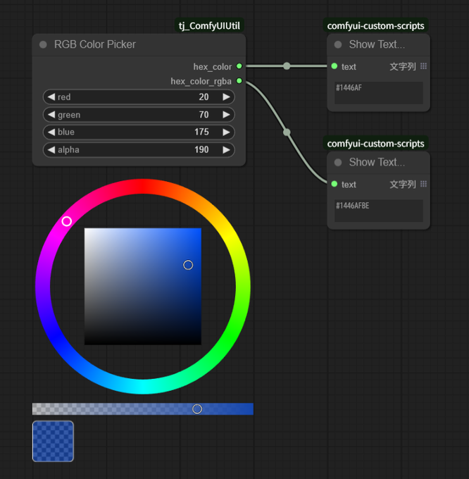

# TJ_ComfyUI_ColorUtility

高精度な RGB/HSV/Alpha カラーピッカーを ComfyUI のカスタムノードとして提供します。

## リポジトリ
- GitHub: https://github.com/TJ16th/TJ_ComfyUI_ColorUtility

## ノード一覧

### RGB Color Picker
高精度な RGB/HSV/Alpha カラーピッカー
- 色相環 + 中央 SV 正方形 (ピクセル単位 HSV→RGB 変換により端の純白/純黒を保証)
- アルファバー + RGBA プレビュー (チェック柄背景)
- #RRGGBB と #RRGGBBAA の 2 出力 (互換性維持のため従来 hex_color も提供)
- ズーム/パン追従する安定したオーバーレイ位置計算
- HiDPI / スケール対応 (devicePixelRatio 利用)
- 端スナップ (左上=白 / 右下=黒) により色の再現性を確保

### Color Palette
8色のプリセットカラーパレット
- 入力: `preset` (primary, pastel, gansai, monochrome など)
- 出力: 8個の #RRGGBB 文字列 (`color_1` ~ `color_8`)
- ノード下部に8色のカラーチップを表示
- プリセット変更で即座にチップ更新
- カスタムパレット対応 (`palettes/` に JSON 配置)

## インストール
1. ComfyUI の `custom_nodes` ディレクトリへ本リポジトリを配置 (もしくは git clone)。
```powershell
cd <ComfyUI>/custom_nodes
git clone https://github.com/TJ16th/TJ_ComfyUI_ColorUtility.git tj_ComfyUIUtil
```
2. ComfyUI を再起動。
3. ノード検索で `RGB Color Picker` を追加。

### 既存クローンのアップデート
```powershell
cd <ComfyUI>/custom_nodes/tj_ComfyUIUtil
git pull --ff-only
```

## 使い方
- RGB スライダーはピッカー操作で自動更新されます。
- 色相：リング部分をドラッグ
- 彩度/明度：中央の正方形をドラッグ (端/隅で純白/純黒を取得)
- アルファ：下部バーを左右へドラッグ
- 出力:
  - `hex_color` : `#RRGGBB`
  - `hex_color_rgba` : `#RRGGBBAA`

## スクリーンショット / 配線例
下図はノードの外観と、2つの出力を `comfyui-custom-scripts / Show Text` に接続して値を表示している例です。



> メモ: 上記画像は `docs/overview.png` を参照しています。お手元の環境で画像を差し替える場合は、`docs/overview.png` にスクリーンショットを配置してください。

## カスタムパレットの作成
`palettes/` フォルダに新しい JSON ファイルを配置することで、独自のカラーパレットを追加できます。

**フォーマット**
```json
{
  "name": "My Custom Palette",
  "colors": [
    "#FF0000",
    "#00FF00",
    "#0000FF",
    "#FFFF00",
    "#FF00FF",
    "#00FFFF",
    "#FFFFFF",
    "#000000"
  ]
}
```

- `colors` 配列は **8色** を含める必要があります。
- 8色未満の場合は `#000000` で埋められます。
- ファイル名 (拡張子を除く) がプリセット名として表示されます。

**例: `palettes/sunset.json`**
```json
{
  "name": "Sunset Gradient",
  "colors": [
    "#FFD700",
    "#FFB347",
    "#FF8C00",
    "#FF4500",
    "#DC143C",
    "#8B0000",
    "#4B0000",
    "#000000"
  ]
}
```

ComfyUI を再起動すると、ColorPalette ノードの `preset` ドロップダウンに反映されます。

## アップデート計画 (例)
- キーボード操作対応
- 可変リング太さ/サイズ設定
- HSV / HSL 数値ウィジェット追加
- カラーパレットのグラデーション生成機能

## ライセンス
本リポジトリは MIT License です。詳細は `LICENSE` を参照してください。

## 貢献
Issue / Pull Request 歓迎です。バグ報告には再現手順と環境情報 (OS, ブラウザ, ComfyUI バージョン) を添えてください。

---
Created by TJ16th. Enjoy creative coloring!
